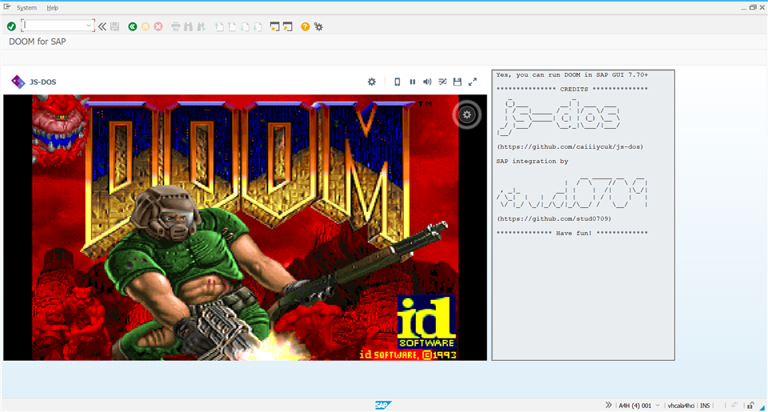

# z_doom
## DOOM for SAP GUI

[Will it run DOOM?](https://www.reddit.com/r/itrunsdoom/) - Yes, it will.

### Prerequisites
- SAP GUI 7.70+
- AS ABAP 1909 or later (if you don't have one, you can get the [Developer Edition](https://blogs.sap.com/2021/02/16/sap-abap-platform-1909-developer-edition-installation-on-windows-os/))

### Installation
- Go to your Client's "Customize Local Layout (Alt+F12)" dialog -> Interaction Design -> Control Settings and change HTML Control to Edge.
- Set logon data for the service z_doom in transaction SICF if you don't want the login dialog to pop up every time.
- Call transation z_doom.
- Enjoy!

### Almost perfect...
- Mouse is not available
- ESC is captured by SAP GUI and not sent to the game. Use virtual keyboard in the game window to press ESC
- Feel free to contribute!

